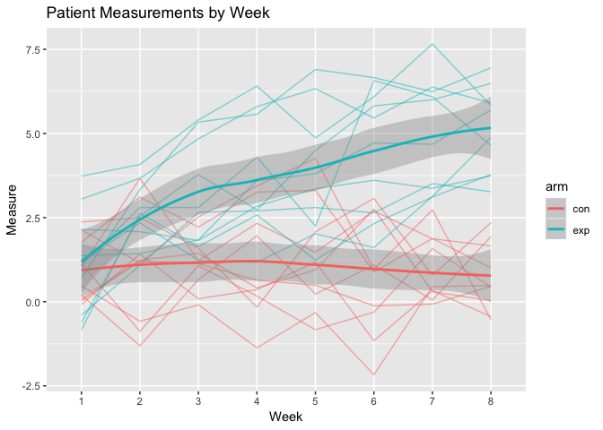

p8105\_hw5\_zdz2101
================
Zelos Zhu
11/3/2018

``` r
library(tidyverse)
```

    ## ── Attaching packages ─────────────────────────────────────────────────────────────────────────────────────────────────── tidyverse 1.2.1 ──

    ## ✔ ggplot2 3.0.0     ✔ purrr   0.2.5
    ## ✔ tibble  1.4.2     ✔ dplyr   0.7.6
    ## ✔ tidyr   0.8.1     ✔ stringr 1.3.1
    ## ✔ readr   1.1.1     ✔ forcats 0.3.0

    ## ── Conflicts ────────────────────────────────────────────────────────────────────────────────────────────────────── tidyverse_conflicts() ──
    ## ✖ dplyr::filter() masks stats::filter()
    ## ✖ dplyr::lag()    masks stats::lag()

``` r
library(purrr)
library(knitr)
library(broom)
library(ggthemes)
```

``` r
setwd("./data/")
patient_df <- tibble(filenames = list.files()) %>%
  mutate(weekly_data = map(filenames, read_csv)) %>%
  unnest() %>%
  mutate(arm = substring(filenames, 1, 3),
         subject_id  = substring(filenames, 5, 6)) %>%
  gather(week, measure, 2:9) %>%
  mutate(week = as.numeric(str_replace(week, "week_","")))
patient_df
```

    ## # A tibble: 160 x 5
    ##    filenames  arm   subject_id  week measure
    ##    <chr>      <chr> <chr>      <dbl>   <dbl>
    ##  1 con_01.csv con   01             1    0.2 
    ##  2 con_02.csv con   02             1    1.13
    ##  3 con_03.csv con   03             1    1.77
    ##  4 con_04.csv con   04             1    1.04
    ##  5 con_05.csv con   05             1    0.47
    ##  6 con_06.csv con   06             1    2.37
    ##  7 con_07.csv con   07             1    0.03
    ##  8 con_08.csv con   08             1   -0.08
    ##  9 con_09.csv con   09             1    0.08
    ## 10 con_10.csv con   10             1    2.14
    ## # ... with 150 more rows

``` r
setwd("..")

ggplot(patient_df, aes(x = week, y = measure, group = filenames, color = arm)) +
  geom_line() +
  scale_x_discrete(name ="Week", limits=1:8) +
  ylab("Measure") +
  ggtitle("Patient Measurements by Week")
```



The trend for control group patients' measurements seems stagnant and don't quite change over time while patients in the experimental arm, their measurements seem to rise over time.

``` r
homicide_df <- read_csv("https://raw.githubusercontent.com/washingtonpost/data-homicides/master/homicide-data.csv")
homicide_df <- homicide_df %>%
  mutate(city_state = str_c(city, ", ", state),
         homicide_status = ifelse(disposition == "Closed by arrest", "Solved", "Unsolved"))

#Homicide Case Counts
homicide_df  %>%
  group_by(city_state) %>%
  count(homicide_status) %>%
  spread(homicide_status, n) %>%
  kable()
```

| city\_state        |  Solved|  Unsolved|
|:-------------------|-------:|---------:|
| Albuquerque, NM    |     232|       146|
| Atlanta, GA        |     600|       373|
| Baltimore, MD      |    1002|      1825|
| Baton Rouge, LA    |     228|       196|
| Birmingham, AL     |     453|       347|
| Boston, MA         |     304|       310|
| Buffalo, NY        |     202|       319|
| Charlotte, NC      |     481|       206|
| Chicago, IL        |    1462|      4073|
| Cincinnati, OH     |     385|       309|
| Columbus, OH       |     509|       575|
| Dallas, TX         |     813|       754|
| Denver, CO         |     143|       169|
| Detroit, MI        |    1037|      1482|
| Durham, NC         |     175|       101|
| Fort Worth, TX     |     294|       255|
| Fresno, CA         |     318|       169|
| Houston, TX        |    1449|      1493|
| Indianapolis, IN   |     728|       594|
| Jacksonville, FL   |     571|       597|
| Kansas City, MO    |     704|       486|
| Las Vegas, NV      |     809|       572|
| Long Beach, CA     |     222|       156|
| Los Angeles, CA    |    1151|      1106|
| Louisville, KY     |     315|       261|
| Memphis, TN        |    1031|       483|
| Miami, FL          |     294|       450|
| Milwaukee, wI      |     712|       403|
| Minneapolis, MN    |     179|       187|
| Nashville, TN      |     489|       278|
| New Orleans, LA    |     504|       930|
| New York, NY       |     384|       243|
| Oakland, CA        |     439|       508|
| Oklahoma City, OK  |     346|       326|
| Omaha, NE          |     240|       169|
| Philadelphia, PA   |    1677|      1360|
| Phoenix, AZ        |     410|       504|
| Pittsburgh, PA     |     294|       337|
| Richmond, VA       |     316|       113|
| Sacramento, CA     |     237|       139|
| San Antonio, TX    |     476|       357|
| San Bernardino, CA |     105|       170|
| San Diego, CA      |     286|       175|
| San Francisco, CA  |     327|       336|
| Savannah, GA       |     131|       115|
| St. Louis, MO      |     772|       905|
| Stockton, CA       |     178|       266|
| Tampa, FL          |     113|        95|
| Tulsa, AL          |       1|        NA|
| Tulsa, OK          |     390|       193|
| Washington, DC     |     756|       589|

``` r
#Just Baltimore
baltimore_prop_df <- filter(homicide_df, city_state == "Baltimore, MD")
baltimore_proptest <- prop.test(table(baltimore_prop_df$homicide_status))
tidy(baltimore_proptest) %>%
  select(estimate, conf.low, conf.high) %>%
  mutate(city = "Baltimore, MD") %>%
  kable()
```

|   estimate|   conf.low|  conf.high| city          |
|----------:|----------:|----------:|:--------------|
|  0.3544393|  0.3368401|  0.3724375| Baltimore, MD |

``` r
#doing it by city
city_props <- homicide_df  %>%
  group_by(city_state) %>%
  count(homicide_status) %>%
  spread(homicide_status, n) %>%
  mutate(total = Unsolved + Solved) %>%
  filter(city_state != "Tulsa, AL") %>%
  mutate(test =  map(map2(.x = Unsolved, .y = total, ~prop.test(x = .x, n = .y)), tidy)) %>%
  unnest() %>%
  select(city_state, estimate, conf.low, conf.high)

kable(city_props)
```

| city\_state        |   estimate|   conf.low|  conf.high|
|:-------------------|----------:|----------:|----------:|
| Albuquerque, NM    |  0.3862434|  0.3372604|  0.4375766|
| Atlanta, GA        |  0.3833505|  0.3528119|  0.4148219|
| Baltimore, MD      |  0.6455607|  0.6275625|  0.6631599|
| Baton Rouge, LA    |  0.4622642|  0.4141987|  0.5110240|
| Birmingham, AL     |  0.4337500|  0.3991889|  0.4689557|
| Boston, MA         |  0.5048860|  0.4646219|  0.5450881|
| Buffalo, NY        |  0.6122841|  0.5687990|  0.6540879|
| Charlotte, NC      |  0.2998544|  0.2660820|  0.3358999|
| Chicago, IL        |  0.7358627|  0.7239959|  0.7473998|
| Cincinnati, OH     |  0.4452450|  0.4079606|  0.4831439|
| Columbus, OH       |  0.5304428|  0.5002167|  0.5604506|
| Dallas, TX         |  0.4811742|  0.4561942|  0.5062475|
| Denver, CO         |  0.5416667|  0.4846098|  0.5976807|
| Detroit, MI        |  0.5883287|  0.5687903|  0.6075953|
| Durham, NC         |  0.3659420|  0.3095874|  0.4260936|
| Fort Worth, TX     |  0.4644809|  0.4222542|  0.5072119|
| Fresno, CA         |  0.3470226|  0.3051013|  0.3913963|
| Houston, TX        |  0.5074779|  0.4892447|  0.5256914|
| Indianapolis, IN   |  0.4493192|  0.4223156|  0.4766207|
| Jacksonville, FL   |  0.5111301|  0.4820460|  0.5401402|
| Kansas City, MO    |  0.4084034|  0.3803996|  0.4370054|
| Las Vegas, NV      |  0.4141926|  0.3881284|  0.4407395|
| Long Beach, CA     |  0.4126984|  0.3629026|  0.4642973|
| Los Angeles, CA    |  0.4900310|  0.4692208|  0.5108754|
| Louisville, KY     |  0.4531250|  0.4120609|  0.4948235|
| Memphis, TN        |  0.3190225|  0.2957047|  0.3432691|
| Miami, FL          |  0.6048387|  0.5685783|  0.6400015|
| Milwaukee, wI      |  0.3614350|  0.3333172|  0.3905194|
| Minneapolis, MN    |  0.5109290|  0.4585150|  0.5631099|
| Nashville, TN      |  0.3624511|  0.3285592|  0.3977401|
| New Orleans, LA    |  0.6485356|  0.6231048|  0.6731615|
| New York, NY       |  0.3875598|  0.3494421|  0.4270755|
| Oakland, CA        |  0.5364308|  0.5040588|  0.5685037|
| Oklahoma City, OK  |  0.4851190|  0.4467861|  0.5236245|
| Omaha, NE          |  0.4132029|  0.3653146|  0.4627477|
| Philadelphia, PA   |  0.4478103|  0.4300380|  0.4657157|
| Phoenix, AZ        |  0.5514223|  0.5184825|  0.5839244|
| Pittsburgh, PA     |  0.5340729|  0.4942706|  0.5734545|
| Richmond, VA       |  0.2634033|  0.2228571|  0.3082658|
| Sacramento, CA     |  0.3696809|  0.3211559|  0.4209131|
| San Antonio, TX    |  0.4285714|  0.3947772|  0.4630331|
| San Bernardino, CA |  0.6181818|  0.5576628|  0.6753422|
| San Diego, CA      |  0.3796095|  0.3354259|  0.4258315|
| San Francisco, CA  |  0.5067873|  0.4680516|  0.5454433|
| Savannah, GA       |  0.4674797|  0.4041252|  0.5318665|
| St. Louis, MO      |  0.5396541|  0.5154369|  0.5636879|
| Stockton, CA       |  0.5990991|  0.5517145|  0.6447418|
| Tampa, FL          |  0.4567308|  0.3881009|  0.5269851|
| Tulsa, OK          |  0.3310463|  0.2932349|  0.3711192|
| Washington, DC     |  0.4379182|  0.4112495|  0.4649455|

``` r
city_props %>%
  ungroup()%>%
  arrange(estimate) %>%
  mutate(city_state = factor(city_state, levels = city_state)) %>%
  ggplot(aes(x = city_state, y = estimate)) + 
  geom_point() + 
  geom_errorbar(aes(x = city_state, ymin = conf.low, ymax = conf.high), width=0.2, size=1, color="blue") + 
  coord_flip() + 
  ylab("Estimated Proportion of Unsolved Homicides") + 
  xlab("City, State") + 
  ggtitle("Estimated Proportion of Unsolved Homicides by City/State") +
  theme_few()
```


